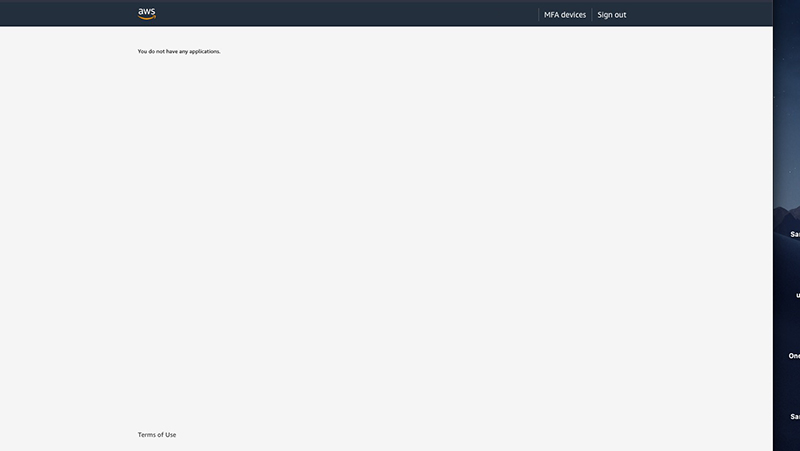
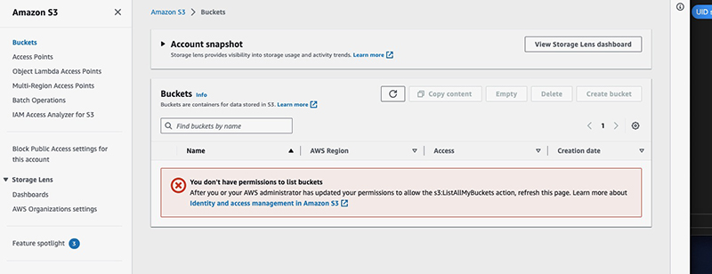

# AWS user permissions

I have a bucket for previewing a side project. It's a simple site-hosting bucket, simple lock-down, nothing unusual.

So I thought.

My collaborator wanted access and sent me this [link on how to set up a bucket user](https://docs.aws.amazon.com/AmazonS3/latest/userguide/example-walkthroughs-managing-access-example1.html) with scoped permissions. I followed the instructions, double, tripple checked, committed the changes, and no dice.

No permissions to see anything.

Oh well, of course. I had used the new IAM Identity Center, and that doesn't behave the same way as IAM Access management Users. Thanks to this [article](https://medium.com/cloud-security/how-to-fix-aws-iam-identity-center-b4e1cdbbcc94), I don't feel bad about my mistake.

Delete the user, start over.

Did the whole process again but this time in the legacy IAM User section.

Not promising.

I asked ChatGPT, checked everything on its list. Everything looked fine. I generated all the actions and resources with AWS's interface. No luck.

It was only when I found a [StackOverflow reply](https://stackoverflow.com/questions/68981538/iam-user-can-not-see-any-bucket-on-s3) that I was able to grant my test user permission to see the bucket.

> If you've attached the "AmazonS3FullAccess" policy to the user and there are no other policies denying access, then the user will be able to see the bucket.

I am sure this is not the best way to scope permissions. Or maybe it is. The way AWS nests documentation means I could have missed this step in the original instructions.

But, future me, it did work.
